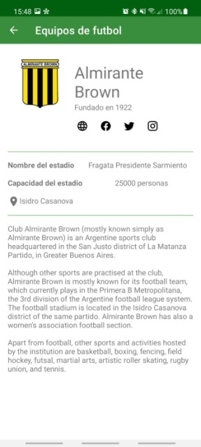
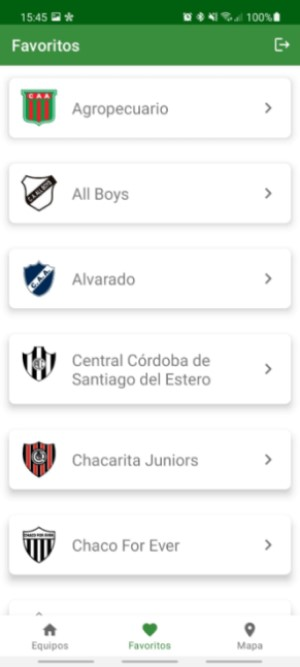
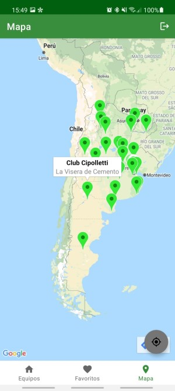

# Challenge - Muni Digital

La aplicacion desarrollada permite la visualizacion de la informacion sobre equipos argentinos de futbol obtenidos de https://www.thesportsdb.com/api.php, conteniendo ademas una vista de login. 

Cuando se ingresa a la aplicacion, se muestra una vista splash que se ejecuta durante 2 segundos mostrando un gif animado y la version de la aplicacion. A continuacion puede observarse la misma.

Esta activity identifica si el usuario se encuentra logueado o no, para decidir si debe mostrar la pantalla de login o directamente se abre la vista principal.

En caso de que no se encuentre un usuario logueado, luego de transcurrido el tiempo estipulado se abrirá la activity donde el usuario podrá loguearse. La autenticacion se realizó con el servicio de Firebase y actualmente hay un usuario activo con las siguientes credenciales: 

* Usuario: test@challenge.com
* Contraseña: 12341234

A continuacion puede observarse la vista de login, que contiene los campos EditText necesarios y el boton para loguearse.

En caso de que no se ingrese un usuario y contraseña o que los mismos sean invalidos, se le informara al usuario mediante mensajes de tipo Toast.

Una vez logueado el usuario, se ingresa a la vista principal que se observa a continuacion.

En esta se observa un tabLayout que permite la navegacion entre la vista principal, la que contiene los favoritos y la que permite visualizar en un mapa la ubicacion de los equipos.

En la vista principal se observa una lista de los equipos que contienen el escudo del mismo, el nombre del equipo y un boton que permite marcar un equipo como favorito o quitarlo de la lista de favoritos.

Para esta implementacion se utilizó un recyclerView donde cada item contiene un cardView.
En toolBar contiene el campo para la busqueda, y el icono para cerrar la sesion.

El campo para la busqueda se implementó utilizando un searchView. Al ingresar texto en este campo, apareceran en la lista unicamente los equipos cuyo nombre lo contenga.

En caso de hacer click sobre el icono para cerrar sesion, se vuelve a la vista de login.

En caso de hacer click sobre un item, se abre una activity que contiene los detalles del equipo.
En esta puede observarse nuevamente el escudo del equipo, el nombre del mismo ademas del año de fundacion del equipo, el nombre, ubicacion y capacidad de su estadio y la descripcion del equipo. En caso de que no se encuentre la informacion sobre la ubicacion o el año en que fue causado, se oculta el elemento mediante el cambio de su visibilidad.
Si lo que no se encuentra es el nombre o capacidad del estadio, en su lugar se muestra "Informacion no disponible".

La api utilizada envia la descripcion en varios idiomas, se escogió mostrar la descripcion en ingles ya que es la que estaba presente en la mayor cantidad de equipos.

A continuacion se observa la vista de detalles.

Debajo del texto que indica el año en el que fue fundado el equipo, pueden observarse una serie de iconos pertenecientes el primero a una pagina web y el resto a redes sociales. Estos son botones de tipo ImageButton que permiten mostrar la pagina web del equipo o la pagina de facebook, twitter o instagram. En caso de que un equipo no contenga una de estas redes sociales, el icono no se muestra. 

Con el boton ubicado en el medio del tabLayout se puede acceder a la vista de favoritos, donde nuevamente hay un recyclerView que contiene una lista de los equipos, pero en esta instancia unicamente los que fueron marcados como favoritos.
Si se presiona un item, nuevamente se abre la vista de detalles explicada anteriormente.
En caso de que ningun equipo se haya seleccionado como favorito, se muestra un mensaje indicando esto.

El tercer boton del tabLayout permite abrir un mapa que contiene la ubicacion de todos los equipos que tienen dicha informacion y la informacion del usuario. Para esto, se requieren permisos de ubicacion.
Este mapa muestra con marcadores en color verde los diferentes equipos y en color rojo la ubicacion del usuario.

En caso de seleccionar un marcador perteneciente a un equipo se muestra el nombre del mismo y del estadio. En la esquina inferior derecha se encuentra un boton que permite mover la camara a la ubicacion del usuario.

